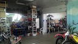
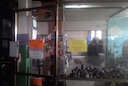

Все стандартные услуги мотосервиса плюс:

* Большой опыт работы с эндуро и кроссовой техникой в частности,
* Наличие расходников на Djebel, XR, TTR и многие другие, в том числе и дорожные мотоциклы,
* Оперативный заказ запчастей и расходников,
* В наличии регулировочные шайбы размерностей 7.48, 8.9, 9.48 и 10мм,
* Масла Motul на разлив из бочки и в канистрах,
* Ремонт амортизаторов, в том числе и изготовление новых штоков,
* Восстановление после ДТП,
* Ремонт электрооборудования, диагностика. Возможен ремонт коммутаторов, генераторов и коррекция пробега на цифровых приборных панелях,
* К предыдущему пункту можно добавить компьютерную диагностику КТМ, перепрошивка мотоциклов этой марки,
* Проведение сварочных работ любой сложности, различные виды сварки - по предварительному звонку,
* Изготовление любых приводных звезд,
* Промывка систем впрыска (чистка инжектора),
* Выездной ремонт и диагностика, осмотр мотоцикла перед покупкой,
* Подготовка мотоциклов к дальним поездкам.

<ul class="clearing-thumbs small-block-grid-3" data-clearing>
  <li></li>
  <li></li>  
</ul>
Приятным бонусом будет традиционное человеческое отношение можно просто приехать попить чаю с печеньками, спросить совета или порыться в куче болтов)